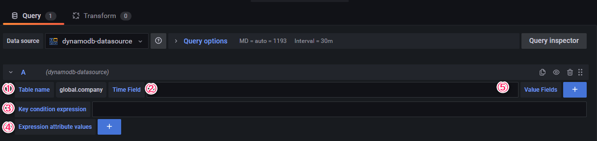

Grafana DynamoDB Datasource Plugin
===
This plugin is for connecting Grafana to AWS DynamoDB.


## Getting started
```bash
# cd /var/lib/grafana/plugins/
# git clone https://github.com/TLV-PMOP/grafana-dynamodb-datasource.git
# service grafana-server restart
```
Plugins directory depends your environment.

## Usage

1. Table name<br>Choose the table name you want to show.
1. Time field<br>Input time field name.
1. Key condition expression<br>Input key condition expression. Refer the AWS page [KeyConditions](https://docs.aws.amazon.com/amazondynamodb/latest/developerguide/LegacyConditionalParameters.KeyConditions.html)
1. Expression attribute values<br>Input expression attribute values. By pressiong + button, you can add fields.
1. Value fields<br>Input field including value. You can specify multiple field.